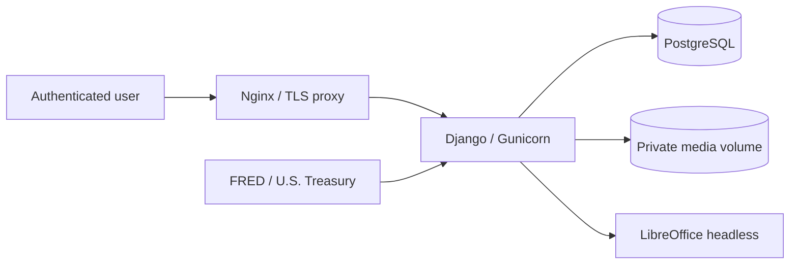

# Architecture

## Runtime

Nginx 僅提供 `/static/` 並反向代理其餘請求；Django/Gunicorn 負責登入、CSRF、domain workflow 與受保護下載；PostgreSQL 是 production 權威資料庫。DOCX/PDF 位於持久化 media volume，不由 Nginx 公開。LibreOffice 使用隔離的 temporary user profile 做 headless DOCX→PDF。

## 模組

- `navapp/models.py`：organization defaults、fund overrides、share class、NAV revisions、RFR cache/snapshot、report lifecycle、hash、audit。
- `navapp/services/calculations.py`：純 Decimal、日期驅動 `legacy_excel_v1`。
- `navapp/services/rfr.py`：官方 provider、timeout/retry/cache、12 個月 snapshot、manual override。
- `navapp/services/imports.py`：CSV/XLSX 與 XSQ legacy parser、dry-run、衝突與來源追蹤。
- `navapp/services/reports.py`：snapshot、chart、DOCX、package audit、LibreOffice PDF、hash、staleness。
- `navapp/views.py`、`forms.py`、`templates/`：server-rendered authenticated workflow。
- `navapp/management/commands/`：bootstrap、seed、import、RFR、sample report。

## 不變條件

- report 唯一鍵為 share class + report type + report date + internal version，fund 必須與 share class 一致；一般介面按期間只呈現最新一筆。
- 每個 share class/month 只有一筆 active NAV；月份必須 month-end。
- FINAL/STALE report 本體不可修改或重新生成；更新 reportable source 只會把 FINAL 轉為 STALE。
- RFR 不得使用 report end 後資料；官方 snapshot 恰好 12 個連續月末值。
- `GeneratedFile.storage_path` 解析後必須位於 `MEDIA_ROOT`，下載只經登入 view。
- DOCX 先保存/稽核，PDF 轉換失敗仍保留可診斷 DOCX 與 `GENERATION_FAILED`。
- 現有自訂 DOCX 範本契約為季報專用；月報使用內建月度回報版面。

## 延伸邊界

MVP media 使用 named volume；未來可在 generated-file storage boundary 換 object storage。ShareClass 與 QuarterlyReport 分離，將來可增加 multi-class consolidated report，而不改現有計算 service。
